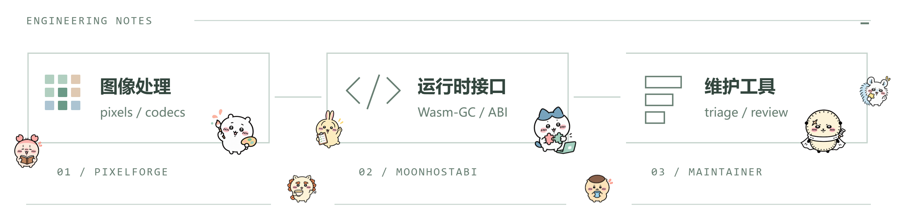

# Fengmin Li

图像处理、WebAssembly 宿主接口与开发者工具。主要使用 **MoonBit / TypeScript / Python**。

[个人站点](https://omnili.site) · [联系我](mailto:2080291162@qq.com) · [开源贡献](#开源贡献)

  <picture>
    <source media="(prefers-color-scheme: dark)" srcset="./assets/chiikawa-engineering-dark.png" />
    
  </picture>

## 主要项目

### [PixelForge](https://github.com/0717lee/pixelforge)

用 MoonBit 实现滤镜与图像编解码，提供可以在浏览器里试用的 Playground。

<code>MoonBit</code> · <code>Image processing</code>

### [MoonHostABI](https://github.com/0717lee/moonhostabi)

面向 Wasm-GC 宿主接口的检查与适配工具：识别编译结果中的接口变化，并生成 TypeScript 适配器，让跨运行时兼容性可以被检查。

<code>MoonBit</code> · <code>WebAssembly</code>

### [OSS Maintainer Assistant](https://github.com/0717lee/OSS-Maintainer-Assistant)

面向开源维护流程的分诊、查重与评审辅助工具，把需要维护者判断的问题更早地整理出来。

<code>Python</code> · <code>LangGraph</code>

## 其他项目

- [WenDao · 古籍智解](https://github.com/0717lee/WenDao)：古籍逐句精讲、问答与竖排 OCR。
- [collabboard](https://github.com/0717lee/collabboard)：支持实时绘画、讨论与版本回溯的协作白板。
- [Lumina Flow](https://github.com/0717lee/lumina-flow)：提供空间思维导图、自动布局与专注模式的无限画布。

## 开源贡献

以下记录均为已合入的上游改动：

查看 6 条已合入记录

| 项目 | 改动 |
| :-- | :-- |
| [MoonBit Core #4181](https://github.com/moonbitlang/core/pull/4181) | 标准库文档与可执行示例 |
| [OpenSeek #1132](https://github.com/moonbitlang/openseek/pull/1132) | 修复浏览器复用标签时地址与页面脱节 |
| [Proton #300](https://github.com/moonbit-community/proton/pull/300) | Windows 高 DPI 窗口过渡的回归测试 |
| [DeerFlow #5453](https://github.com/bytedance/deer-flow/pull/5453) | 保留内存模式下的运行历史 |
| [nanobot #5602](https://github.com/HKUDS/nanobot/pull/5602) | WebUI 回合完成提示音 |
| [ContextForge Web UI #106](https://github.com/contextforge-org/contextforge-web-ui/pull/106) | 区分加载失败与空列表，支持重试 |

[全部合入记录](https://github.com/search?q=is%3Apr+author%3A0717lee+is%3Amerged&type=pullrequests) · [正在推进的 PR](https://github.com/search?q=is%3Apr+author%3A0717lee+is%3Aopen&type=pullrequests)

生态 fork

参与过 [sandbase-harness](https://github.com/sandbaseai/sandbase-harness)、[dsh-plugin-store](https://github.com/sandbaseai/dsh-plugin-store)、[awesome-agent-runtime](https://github.com/sandbaseai/awesome-agent-runtime) 和 [deepseek-harness-handbook](https://github.com/sandbaseai/deepseek-harness-handbook) 生态；个人账号下的对应仓库是上游 fork。

